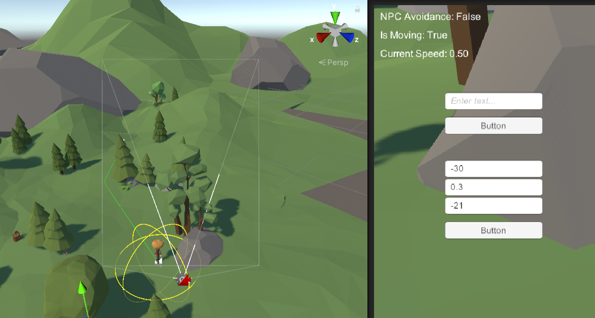
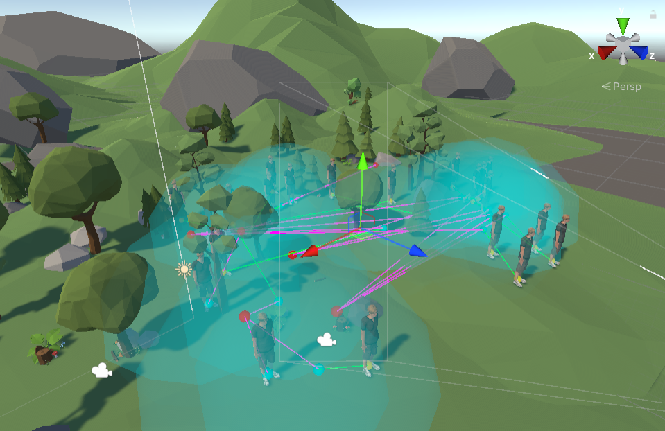

# A Virtual Navigation Assistant System for Visually Impaired Users

**Xinyu Wu**  
MSc Information and Network Engineering
<xinywu@kth.se>

## Abstract

This project introduces a 3D virtual navigation assistant tailored for visually impaired users within a Unity environment. The system integrates spatial audio feedback, dynamic pathfinding, and real-time user interaction to support accessible navigation. Core functionalities include obstacle detection with proximity-based beep feedback, NPC crowd avoidance, and voice-based assistant responses. Through a combination of animation, agent-based simulation, and perceptual design principles, the project demonstrates a functional prototype that enhances situational awareness and usability for users with limited vision.

**Below is a demo video.**
<iframe width="100%" height="400" 
            src="https://www.youtube.com/embed/jxW6GEjU-rc?autoplay=1&mute=1&loop=1" 
            frameborder="0" allowfullscreen>
    </iframe>

    
## 1. Introduction

Visually impaired individuals often rely on auditory helping devices for navigation. In this project, we designed a virtual assistant in a 3D Unity world to simulate such guidance. The assistant reacts to user input and leads users to their destination. **Our main goal was to explore the integration of computer graphics, animation, and accessibility support.**

## 2. Project Specification

The system is designed to provide **an accessible and interactive 3D navigation assistant tailored for visually impaired users**. The key components of the system include:

- **A Unity-based virtual outdoor environment** simulating natural elements and terrain.
- **A virtual assistant character** with animations for idle, walking, waving, and talking, providing voice interaction and guidance.
- **A crowd simulation module** modeling multiple pedestrian agents with group behaviors and local avoidance.

## 3. Implementation Details

### 3.1 Scene and Agents

The **virtual environment** is based on an existing asset from the Unity Asset Store titled *Simple Nature Pack*, which provides a stylized outdoor scene including elements such as trees, rocks, and stumps.

![Scene of Simple Nature Pack [3]](forest.png)

To maintain a consistent visual style, the **virtual assistant** is represented as a cartoon-style child character named *Ty*, downloaded from Mixamo. For character animation, several motion clips were also imported from Mixamo, including *Idle*, *Walk*, *Wave*, and *Talk* [5]. These animations were integrated into the character's Animator Controller to support basic state transitions during interactions.

![The virtual assistant represented as a cartoon-style child character named Ty from Mixamo [5]](ty.png)

![The pedestrian represented as a standard adult male model named Remy from Mixamo [5]](remy.png)

To simulate **pedestrian flow** in the environment, an additional character named *Remy* — a standard adult male model from Mixamo - was used. Multiple instances of this character were randomly placed and controlled by a custom script, allowing them to move around the environment with varied timing and destinations, mimicking natural crowd behavior.

**A third-person camera** is positioned behind the virtual assistant to **simulate the visual perspective of users**. This camera setup can be flexibly modified to imitate various visual impairments (e.g., narrowed field of view) or different user heights (e.g., child or wheelchair-level perspectives), offering adaptability for accessibility-focused simulations.

### 3.2 Assistant FSM System

The assistant character is implemented as **a finite state machine (FSM)** using Unity's Animator, NavMeshAgent, and a custom controller script *AssistantFSM.cs*. The system handles multi-modal user interactions, pathfinding, environment-aware obstacle detection, and audio-visual feedback.

#### 3.2.1 Greeting Interaction

When the user types "hi" into the interface, the assistant waves and plays a greeting voice line. This state is triggered via a UI InputField and a Button, and is only accepted once per session to simulate a natural one-time onboarding interaction. After greeting, the assistant prompts the user to input a destination.

#### 3.2.2 Navigation and Path Visualization

The user can input a destination using coordinate input fields. The assistant validates the input against Unity's NavMesh, sets the destination, and begins walking with a green path visualized using a LineRenderer. If the assistant reaches the destination, it plays a completion voice line.

#### 3.2.3 Timeout and Unreachable Target Handling

If the assistant cannot reach the destination within a fixed duration (100 seconds), the system checks the remaining distance. If the assistant is close to the destination (less than 2 meters), it plays a "near but unreachable" voice line. Otherwise, it plays a "target unreachable" warning, prompting the user to enter a new destination.

#### 3.2.4 NPC Proximity Awareness

To simulate crowd navigation, the assistant checks for nearby NPCs with the tag "People". If an NPC comes within 2.5 meters, the assistant stops moving, disables the walk animation, and plays an alert voice line. Once the NPC leaves, the assistant resumes walking automatically.

#### 3.2.5 Obstacle Detection Beep Feedback

Environmental awareness is implemented using another query on a separate "Obstacle" layer. When obstacles are detected within 5 meters, the assistant emits periodic beep sounds with increasing frequency as the obstacle gets closer, mimicking real-world assistive proximity sensors.

### 3.3 Crowd Simulation

The crowd simulation module models human-like pedestrian behaviors through a combination of Unity's NavMeshAgent system and two custom scripts. These scripts work together to dynamically create, assign, and control multiple virtual agents that navigate the environment in groups, responding to interest points and avoiding collisions, thereby enhancing the realism of the virtual world.

#### 3.3.1 Agent Spawning and Group Assignment

Crowd agents are spawned at runtime using the *CrowdSpawner.cs* script, which instantiates multiple NPCs around a central point by sampling valid positions from the navigation mesh. After spawning, the agents are randomly shuffled and divided into small groups (default size of 4 or fewer). Each group is assigned a unique destination chosen from game objects tagged as "Interest". This ensures spatial diversity in group movement and allows agents to pursue distinct goals within the scene.

To ensure robustness, the system validates the availability of interest points before assigning them. If no valid target exists, agents are skipped for group assignment to prevent runtime errors.

#### 3.3.2 Group-Aware Movement and Navigation

Each agent in the simulation is controlled by the *CrowdAgent.cs* script, which implements **a simplified version of the classic Boids algorithm** proposed by Reynolds in 1987 [1]. The Boids model is a rule-based system used to simulate flocking behavior through three primary forces: Attraction, Cohesion, and Separation.

In my implementation:
- **Attraction** is realized by guiding the agent toward the assigned group target (an environmental interest point).
- **Cohesion** is applied by pulling each agent slightly toward the average position (centroid) of its current group.
- **Separation** is implemented by applying a repelling force when an agent gets too close to neighboring group members, helping maintain realistic interpersonal distance.

These three directional vectors are normalized and combined to determine a hybrid steering direction, which is then rotated by a small random angle to introduce variability and avoid overly deterministic paths. The agent attempts to walk toward a sampled NavMesh point in that direction. Before movement begins, feasibility is ensured to confirm the destination is valid.

Group movement goals are periodically updated (every 30-45 seconds) by sampling nearby interest points, allowing agents to exhibit dynamic and exploratory behavior over time.

#### 3.3.3 Local Avoidance and Animation Integration

The agents use Unity's built-in local avoidance from the NavMeshAgent system to dynamically avoid collisions with other NPCs, the assistant, and static obstacles. Parameters such as radius and avoidance priority are configured to promote smooth path redirection and natural crowd dispersion.

Additionally, each agent is equipped with an animator that switches between idle and walking states depending on movement velocity. This integration provides visual cues for agent state and enhances the realism of their behavior.

#### 3.3.4 Assistant Awareness and Crowd Interaction

The crowd simulation system also interacts with the assistant module. When any crowd agent enters a 3-meter proximity of the assistant, the assistant's FSM triggers a safety alert through voice feedback. This interaction is handled via checking with agents tagged as "People". This not only improves immersion but also simulates real-world spatial awareness and respect for personal space.

## 4. Evaluation and Reflection

Developing this assistant revealed **several challenges**:
- Synchronizing animation transitions with audio cues and character movement.
- Avoiding false obstacle detections caused by uneven terrain geometry.
- Ensuring robust pathfinding behavior when the destination is unreachable or blocked.
- Balancing NPC density to simulate realistic crowd movement without overwhelming the navigation system.

The system underwent continuous iterations based on testing feedback. Starting from basic point-to-point navigation, I progressively added features such as obstacle avoidance, voice feedback, and dynamic path adjustment in crowded environments. These updates reflect a gradual evolution from simple navigation to intelligent, responsive interaction.

I also refined the beep-based alert system through multiple iterations—transitioning from volume-based cues to frequency-based ones—resulting in more intuitive feedback with fewer false alarms.

To enhance realism, the crowd simulation system was also revised multiple times. Improvements included grouping behavior, attraction to points of interest, and local avoidance strategies, creating a more lifelike and dynamic environment.

However, **several limitations** remain in the current system:
- *Lack of real user testing*: No usability study has been conducted with visually impaired participants to evaluate the practical effectiveness of the assistant.
- *No voice input support*: All interactions rely on predefined keyboard input, which limits accessibility and realism.
- *Absence of authentic feedback*: The system has not been validated or refined based on feedback from blind or low-vision users.

These limitations highlight the need for future iterations that focus on user-centered evaluation, voice-based interaction, and collaboration with accessibility communities.

## 5. Perceptual and User Study Context

This project aligns with perceptual principles in accessibility. Although the system is designed for visually impaired users, no formal user study has yet been conducted due to time and resource limitations. Therefore, current development decisions rely primarily on theoretical understanding of accessibility principles, informal testing, and iterative design feedback.

Our perceptual assumptions are grounded in **key principles from accessible design literature**, including [6]:

- **The importance of non-visual cues**, such as audio feedback, for spatial orientation.
- The **use of spatialized sound** (e.g., directional beeps) to guide attention and communicate proximity to obstacles.
- **The necessity for simple and consistent feedback** to avoid cognitive overload for users navigating without vision.

Throughout development, we simulated user interactions by testing common navigation tasks, such as finding a destination, avoiding dynamic obstacles, and adapting to crowded environments. Feedback from sighted users performing these tasks without visual input (e.g., blindfolded trials) helped refine timing, voice prompts, and system responses.

However, this **proxy testing cannot replace real user validation**. The lack of input from visually impaired individuals remains a critical limitation. Additionally, the system currently does not support natural input methods like voice commands, which would be essential for real-world use by blind users.

A full perceptual and user study in future work will focus on:

- **Evaluating the clarity and usability of the beep system in real navigation tasks.**
- **Measuring user comfort and efficiency in crowded or obstacle-rich scenes.**
- **Gathering qualitative feedback to adapt the behavior of the system to various user preferences.**

This will be crucial in verifying whether the assistant truly improves spatial awareness, navigation confidence, and user autonomy in virtual and potentially real-world applications.

## 6. Conclusion

This project presents an accessible virtual assistant designed for visually impaired users. By combining Unity's animation and AI features with perceptual design elements like spatial sound and obstacle awareness, we developed a prototype capable of intuitive interaction in a 3D environment. The assistant not only guides users via audio but also adapts to environmental dynamics such as moving NPCs and unreachable destinations. The framework demonstrates strong potential for future applications in VR training, assistive technology, and inclusive game design, especially when enhanced with voice recognition and haptic feedback.

Some parts of this project, including the polishing of the report language and improvements in the Csharp code structure, were assisted by ChatGPT [4].

## References

1. C. W. Reynolds, "Flocks, Herds, and Schools: A Distributed Behavioral Model," *ACM SIGGRAPH Computer Graphics*, vol. 21, no. 4, pp. 25-34, 1987.

2. Unity Technologies, "Unity Navigation and Pathfinding,"  [Online]. Available: <https://docs.unity3d.com/Manual/nav-BuildingNavMesh.html>

3. Synty Studios, "Low Poly Simple Nature Pack," Unity Asset Store, 2020. <https://assetstore.unity.com/packages/3d/environments/landscapes/low-poly-simple-nature-pack-162153>

4. OpenAI, "ChatGPT: AI Language Model for Text Revision and Code Assistance," OpenAI, 2024. <https://chat.openai.com>

5. Adobe Mixamo, "3D Character Animation Platform," <https://www.mixamo.com>

6. W3C, "Web Content Accessibility Guidelines (WCAG)," World Wide Web Consortium (W3C), 2023. [Online]. Available: <https://www.w3.org/WAI/standards-guidelines/wcag/>
